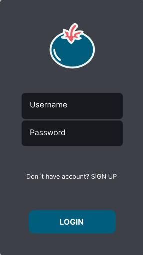
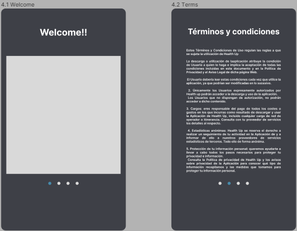
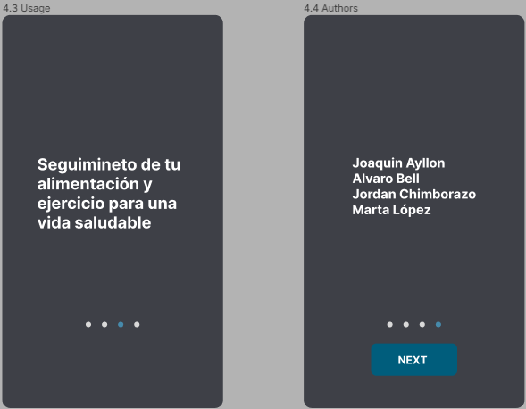
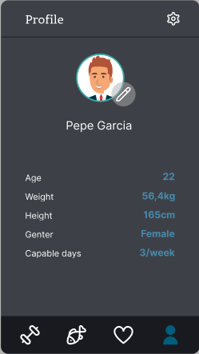
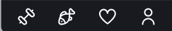
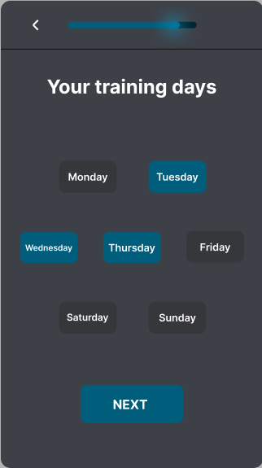
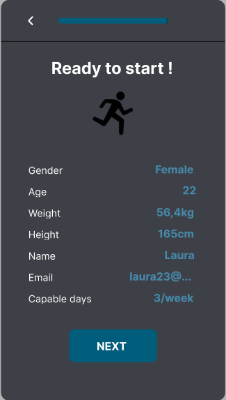
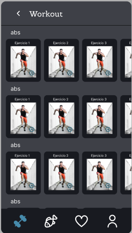
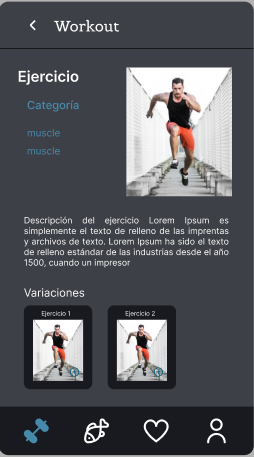
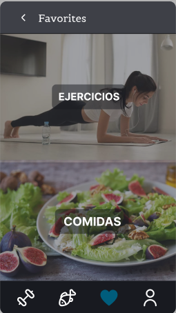

# Health up -- Alimentacion y deporte
    
-- Login de inicio de aplicación --

-- Presentación de la aplicación en el primer inicio de sesión --

-- Prototipo en figma --

Pelfil del usuario

Navigation bar

Progress bar para Sign up

      

Ejemplos del Sign up

Pantalla de ejercicios

       

Pantalla de favoritos

https://www.figma.com/file/fHtFCWCAkLZTQdqZ4F44fX/Untitled?node-id=0%3A1&t=RsfQHG8iXH8gJREM-0

>This repository is licensed under
>[Creativecommons Org Licenses By Sa 4](http://creativecommons.org/licenses/by-sa/4.0/)