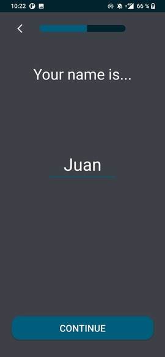
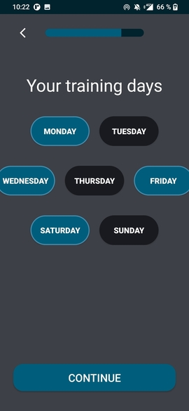
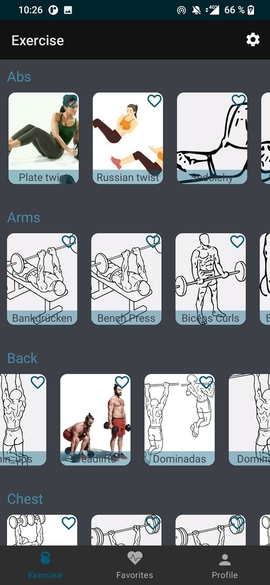

# Health up -- Alimentacion y deporte

-- Presentación de la aplicación en el primer inicio de sesión --

-- Login de inicio de aplicación --

-- Pelfil del usuario --

-- Sign up --

   

       

Progress bar para Sign up

  

-- Ejercicios --

   

Información detallada de cada ejercicio

-- Favoritos --

-- Enlace a nuestro figma --

https://www.figma.com/file/fHtFCWCAkLZTQdqZ4F44fX/Untitled?node-id=0%3A1&t=RsfQHG8iXH8gJREM-0

>This repository is licensed under
>[Creativecommons Org Licenses By Sa 4](http://creativecommons.org/licenses/by-sa/4.0/)